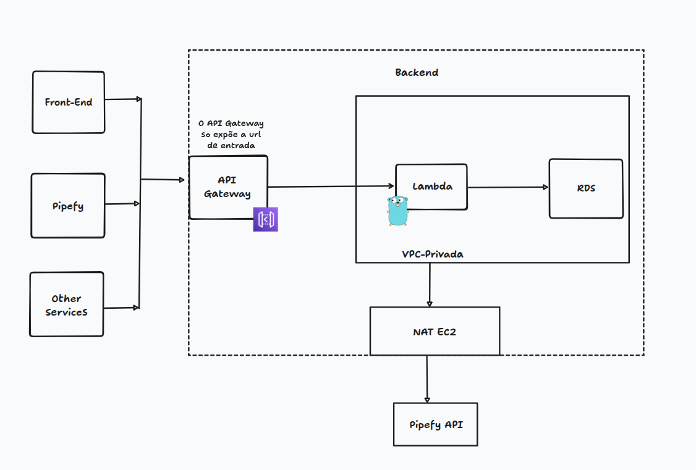
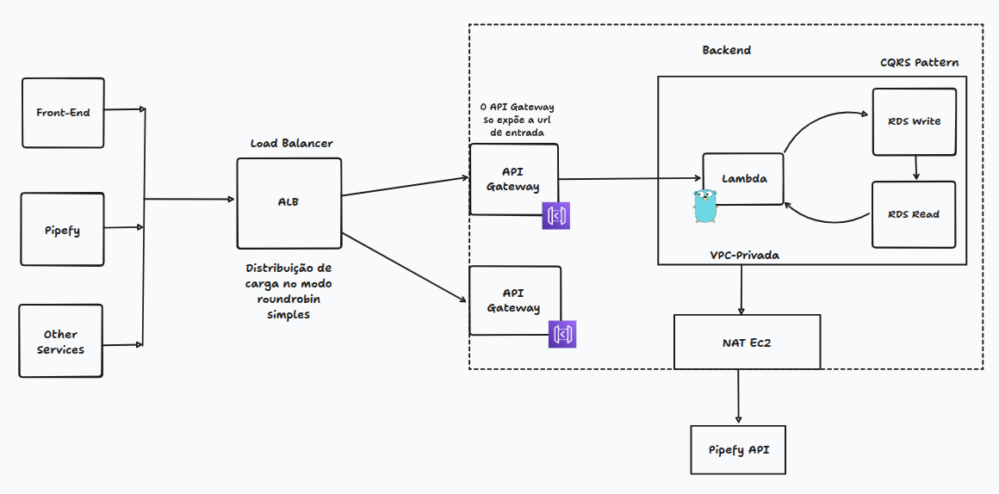

# core-api

API REST em Go que integra com o Pipefy para criação de clientes e processamento de webhooks de atualização de cards.

## Endpoints

| Método | Rota | Descrição |
|--------|------|-----------|
| `POST` | `/clients` | Cria um novo cliente e abre um card no Pipefy |
| `POST` | `/webhooks/pipefy/card-updated` | Recebe webhook de atualização de card do Pipefy |

---

## Execução local

### Pré-requisitos

- [Go 1.22+](https://go.dev/dl/)
- [Docker](https://docs.docker.com/get-docker/) e Docker Compose
- [`migrate`](https://github.com/golang-migrate/migrate) (para rodar migrations manualmente)

### 1. Instalar golang-migrate

```bash
go install -tags 'postgres' github.com/golang-migrate/migrate/v4/cmd/migrate@latest
```

Confirme a instalação:

```bash
migrate -version
```

### 2. Variáveis de ambiente

```bash
cp .env.example .env
```

Edite o `.env` conforme necessário. Valores padrão funcionam para desenvolvimento local com Docker.

### 3. Subir com Docker Compose (recomendado)

Sobe a API, o banco PostgreSQL e o mock do Pipefy juntos:

```bash
docker compose up --build
```

A API ficará disponível em `http://localhost:8080`.

### 4. Rodar apenas o banco e o mock via Docker

```bash
docker compose up psql_bp mock-pipefy
```

Em outro terminal, dentro de `core-api/`:

```bash
cp .env.example .env        # ajuste DATABASE_URL se necessário
make migrate-up             # aplica as migrations
make run                    # inicia a API
```

### 5. Live reload (desenvolvimento)

Requer [`air`](https://github.com/air-verse/air):

```bash
cd core-api
make watch
```

---

## Testes

### Testes unitários

```bash
cd core-api
make test
```

### Testes de integração

Usam [testcontainers](https://testcontainers.com/) — o banco e o mock do Pipefy sobem automaticamente durante o teste. Só precisa do Docker engine rodando:

```bash
cd core-api
make itest
```

---

## Exemplos de requisição

### POST /clients

Cria um cliente e abre um card no Pipefy com os dados fornecidos.

**Request:**
```bash
curl -X POST http://localhost:8080/clients \
  -H "Content-Type: application/json" \
  -d '{
    "cliente_nome": "João Silva",
    "cliente_email": "joao.silva@example.com",
    "tipo_solicitacao": "abertura_conta",
    "valor_patrimonio": 150000.00
  }'
```

**Response (201 Created):**
```json
{
  "nome": "João Silva",
  "email": "joao.silva@example.com",
  "tipo_solicitacao": "abertura_conta",
  "status": "pending",
  "prioridade": "high",
  "valor_patrimonio": 150000.00
}
```

---

### POST /webhooks/pipefy/card-updated

Recebe notificação do Pipefy quando um card é atualizado e sincroniza o status do cliente no banco.

**Request:**
```bash
curl -X POST http://localhost:8080/webhooks/pipefy/card-updated \
  -H "Content-Type: application/json" \
  -d '{
    "event_id": "evt_abc123",
    "card_id": "987654321",
    "cliente_email": "joao.silva@example.com",
    "timestamp": "2026-05-29T10:00:00Z"
  }'
```

**Response (200 OK):**
```json
{
  "message": "card updated successfully"
}
```

---

## Comandos úteis

```bash
make build          # compila o binário
make run            # roda a API
make test           # testes unitários
make itest          # testes de integração
make watch          # live reload com air
make docker-run     # docker compose up --build
make docker-down    # docker compose down
make migrate-up     # aplica migrations
make migrate-create name=<nome>   # cria nova migration
```

## Arquitetura na AWS

### Carga baixa

Para volumes de requisição moderados, a arquitetura é simples e serverless. O API Gateway é o único ponto de entrada público e roteia as chamadas diretamente para uma função Lambda (Go) dentro de uma VPC privada. O Lambda acessa o RDS na mesma VPC e sai para a Pipefy API via NAT em uma instância EC2.



### Carga alta

Para volumes maiores, um ALB (Application Load Balancer) é adicionado na frente, distribuindo as requisições entre múltiplos API Gateways no modo round-robin. No lado do banco, o padrão CQRS separa as instâncias de escrita e leitura do RDS, evitando contenção. O fluxo de saída para a Pipefy API segue o mesmo caminho via NAT EC2.


